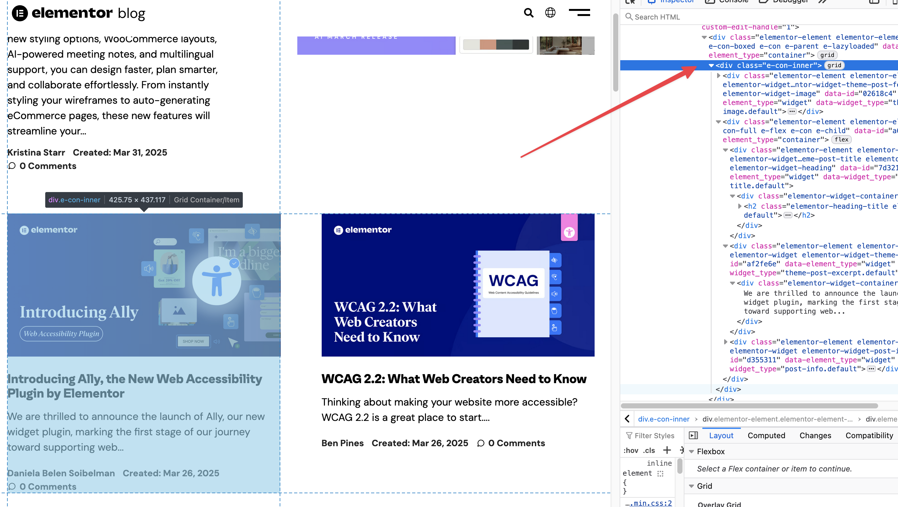

# RSS Generator

A simple and lightweight RSS feed generator built with Python. 
Generate and manage RSS feeds from any website by scraping content using custom CSS selectors.

## What is RSS?
RSS (Really Simple Syndication) is a web feed format that allows users and applications to access updates to websites in a standardized, computer-readable format. This generator is particularly useful for blog sites that do not provide a native RSS feed, enabling you to follow content updates through your preferred RSS reader.

## Features

- Generate RSS feeds from various data sources.
- Customizable feed attributes.
- Lightweight and easy to use.

## Tech Stack
- **FastAPI**: Modern, high-performance web framework for building APIs
- **Pydantic**: Data validation and settings management
- **Google Cloud Firestore**: NoSQL document database for cloud storage
- **BeautifulSoup4**: Library for parsing HTML and extracting data
- **FeedGen**: Library for generating RSS/Atom feeds
- **Uvicorn**: ASGI server for serving the FastAPI application
- **Python 3.8+**: Modern Python with type annotations

## Pre-requisites
- Python 3.8 or higher
- Google Cloud account with Firestore enabled
- Google Cloud SDK installed and configured
- Basic understanding of CSS selectors

## Installation

1. Clone the repository:
    ```bash
    git clone https://github.com/pschua/rss-feed-generator.git
    ```
2. Navigate to the project directory:
    ```bash
    cd rss-feed-generator
    ```
3. Create and activate a virtual environment:
    ```bash
    python -m venv venv
    source venv/bin/activate  # On Windows: venv\Scripts\activate
    ```
4. Install dependencies:
    ```bash
    pip install -r requirements.txt
    ```
5. Set up Google Cloud Credentials
    ```bash
    # Set the application default credentials
    gcloud auth application-default login

    # Or set the GOOGLE_APPLICATION_CREDENTIALS environment variable
    export GOOGLE_APPLICATION_CREDENTIALS="path/to/your/service-account-key.json"
    ``` 

### Required Google Cloud Permissions
Your service account will need the following roles:

- `roles/datastore.user` - For Firestore access

(include the ones below if using GitHub Actions)
- `roles/run.admin` - For Cloud Run deployment
- `roles/cloudbuild.builds.editor` - For Cloud Build operations
- `roles/cloudscheduler.admin` - For Cloud Scheduler configuration


## Usage

### Running the API locally
```bash
uvicorn main:app --reload
```
The API will be available at http://localhost:8000

### API Documentations
Once running, access the auto-generated API documentation at:

- Swagger UI: http://localhost:8000/docs
- ReDoc: http://localhost:8000/redoc

### Creating a New Feed Source
To create a new feed source, send a POST request to /sources/ with a JSON body:
```json
{
    "name": "Example Blog",
    "url": "https://example.com/blog",
    "selector": "article.post",
    "description": "Example blog feed"
}
```
#### Response format
```json
{
    "name": "string",
    "url": "string",
    "selector": "string",
    "description": "string",
    "id": "string",
    "last_refreshed": "2025-04-03T11:57:48.162Z"
}
```

### Finding the selector
The selector is a CSS selector that identifies the HTML elements containing article information on a web page. To find the right selector:

1. Open the target website in Chrome or Firefox.
2. Right-click on an article element and select "Inspect" or "Inspect Element".
3. Look for a container element that wraps all the article content (title, description, date).
4. Identify a unique class or ID that all article containers share.

For example, if articles are structured like this:
```html
<div class="articles">
  <article class="post">
    <h2 class="title">Article Title</h2>
    <div class="meta">July 1, 2023</div>
    <div class="excerpt">Article excerpt...</div>
  </article>
  <!-- More articles -->
</div>
```
The appropriate selector would be `article.post`.

[!IMPORTANT] 
Be mindful of the websites you scrape - ensure you're complying with their terms of service and robots.txt policies.

#### Selector Example
The image below shows the selector you should use for the Elementor blog page:

[!NOTE]
This example is for illustration purposes

It's recommended to test your selector using the browser console before adding it to your feed configuration:
```javascript
// Test in browser console
document.querySelectorAll('your-selector-here').length
// Should return the number of articles on the page
```

### Complete Workflow Example

Start the local server:
```bash
uvicorn main:app --reload
```

Create a new feed source:
```bash
curl -X POST http://localhost:8000/sources/ \
  -H "Content-Type: application/json" \
  -d '{"name":"Tech Blog","url":"https://example.com/tech","selector":"article.blog-post","description":"Latest tech articles"}'
```

Note the returned source ID (e.g., `abc123`).
Access your RSS feed:
```
http://localhost:8000/feed/abc123
```

Add this URL to your RSS reader application.

## Deployment to Cloud Run

This project includes a GitHub Actions workflow (`.github/workflows/deploy.yml`) for deploying to Google Cloud Run. To replicate the deployment process, follow these steps:

1. Ensure you have a Google Cloud project set up with billing enabled.
    - Ideally this should be the same as the one enabled for Cloud Firestore
2. Enable the Cloud Build API, Cloud Run API and Cloud Scheduler API in your Google Cloud project.
3. Set up a service account with the necessary permissions and download the JSON key file.
    - The service account will need permissions for Cloud Build, Cloud Run, Cloud Scheduler, and Artifact Registry.
    - Having 'Viewer' access could help prevent logging issues during the build.
4. Add the following secrets to your GitHub repository:
    - `GCP_PROJECT`: Your Google Cloud project ID.
    - `GCP_REGION`: The region where your Cloud Run service will be deployed (e.g., `us-central1`).
    - `GCP_SA_KEY`: The base64-encoded content of your service account JSON key file.
5. Push your changes to the `main` branch (or the branch specified in the workflow). The GitHub Actions workflow will automatically build and deploy the application to Cloud Run.

You may also change the Cloud Scheduler's refresh interval in the [GitHub Actions workflow file](.github/workflows/deploy.yml). It currently refreshes every 12 hours.

Once deployed, go to the Cloud Run URL to add your feed via `/sources` or via `/docs`.

The `/feed/{source_id}` link can be used on your RSS app (e.g. Feedly) to retrieve the articles.

## Limitations
- The script uses several heuristics to determine the elements of an RSS feed (like scanning for `h1`, `h2`, `h3` tags for titles). These might not work optimally for all websites.
- The generator only pulls articles from a single page, which means it won't include older posts that require pagination.
- The RSS feeds generated do not include images.
- Complex dynamic websites using JavaScript to load content may not work well with the current scraping approach.

## License

This project is licensed under the [MIT License](LICENSE).